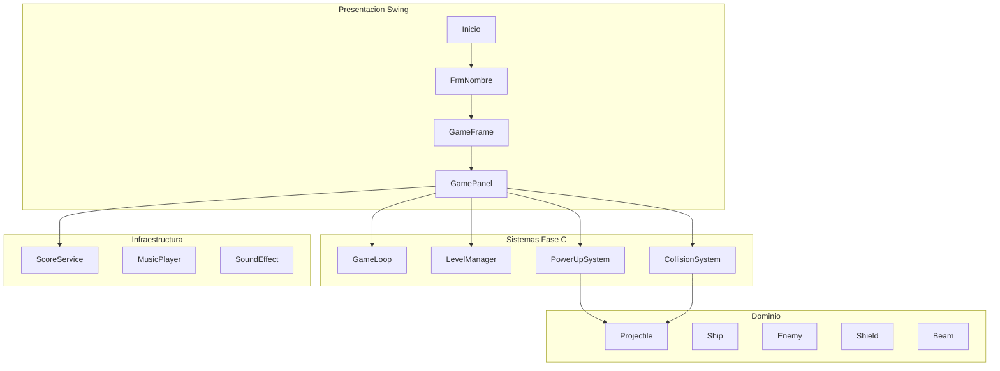

# Arquitectura y estructura de carpetas

## Estado anterior (NetBeans Ant)

```
src/
  Game/           # UI + lógica + entidades mezcladas
  Clases/         # DAO de scores
  ClaseConexion/  # JDBC
  Controlador/    # Teclado
  Tipografia/
  Imagenes/       # Assets junto al código
  Sonidos/
nbproject/        # Configuración IDE
sqljdbc42.jar     # Driver binario en la raíz
```

Problemas: assets en `src`, classpath frágil, configuración de máquina local, sin separación test/main.

## Estado actual (Maven estándar)

```
src/main/java/          → código compilable
src/main/resources/     → assets y configuración
src/test/java/          → tests (preparado)
docs/                   → documentación Markdown
sql/                    → scripts de BD
legacy/netbeans/        → proyecto histórico
src/main/java/persistence/ → scores offline + JDBC
```

Esta disposición permite:

- Empaquetar un JAR ejecutable con recursos en el classpath.
- Compilar/ejecutar igual en cualquier IDE (IntelliJ, VS Code, Eclipse, NetBeans).
- CI/CD con `mvn verify` sin depender de NetBeans.

## Capas lógicas actuales



## Jerarquía de entidades (ya existente)

Se conserva un esbozo de OOP clásico de juegos 2D:

```
Drawable
  └── GameObject
        ├── MovingGameObject
        │     ├── Bullet / Bullet2…Bullet7
        │     ├── Beam
        │     ├── Enemy
        │     └── ElementoDrop
        └── ControlledGameObject
              └── Ship
```

Es un buen punto de partida; la deuda está en la orquestación (`GamePanel`), no en la jerarquía base.

## Estructura objetivo recomendada (fase 2)

Cuando el proyecto crezca, renombrar paquetes y separar responsabilidades:

```
com.spacechemistry
  ├── app                 # main, bootstrap
  ├── ui.menu             # Inicio, créditos, ayuda, records
  ├── ui.game             # GameFrame, GamePanel (delgado)
  ├── core                # loop, estado, niveles
  ├── entities            # Ship, Enemy, Projectile, Shield…
  ├── systems             # CollisionSystem, PowerUpSystem, ScoreSystem
  ├── audio               # MusicPlayer, SoundEffect
  ├── persistence         # ScoreRepository, JdbcScoreRepository, FileScoreRepository
  └── resources           # carga tipografías / imágenes
```

Ventajas: testabilidad, menos acoplamiento, onboarding más claro, posibilidad de cambiar Swing por LibGDX/JavaFX sin reescribir dominio.
